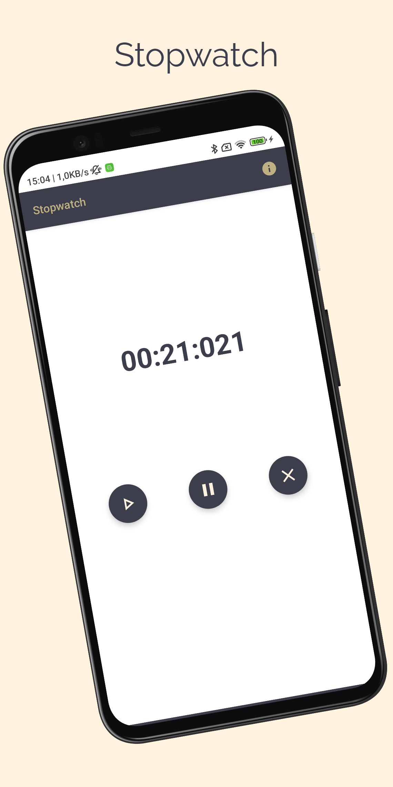

# Stopwatch
> <b>Author: Nicola De Nicolais</b>

## 📄 Description
Android application built with Kotlin and Jetpack Compose that allows you to time the time spent in a certain activity. Time can be started, stopped and resumed.<br/>
The realization of this application was inspired by Philipp Lackner with his video "20 Android App Ideas" and this is the #3 of the list.

## 🔨  How to install and run the project
Clone this repository :<br/>
`
git clone https://github.com/ndenicolais/Stopwatch.git
`

Import the project into Android Studio :

1. File -> New -> Import Project
2. Browse to <path_to_project>
3. Click "OK"

Create a new virtual device or connect an Android device to your computer.</br>
Click Run to start the project on the selected device.

## 🛠️ Built with
Kotlin</br>
Jetpack Compose

## 📚 Package Structure

```
com.denicks21.stopwatch        # ROOT PACKAGE
│
├── ui.theme                    # THEME FOLDER
|   │   ├── Color               # Color palette used by the app.
|   │   ├── Shape               # Components shapes of Compose used by the app.
|   │   ├── Theme               # Theme used by the app.
|   │   ├── Type                # Typography styles for the fonts used by the app.
|
├── MainActivity                # Main activity
```

## 📎 Screenshots
<p float="left">

